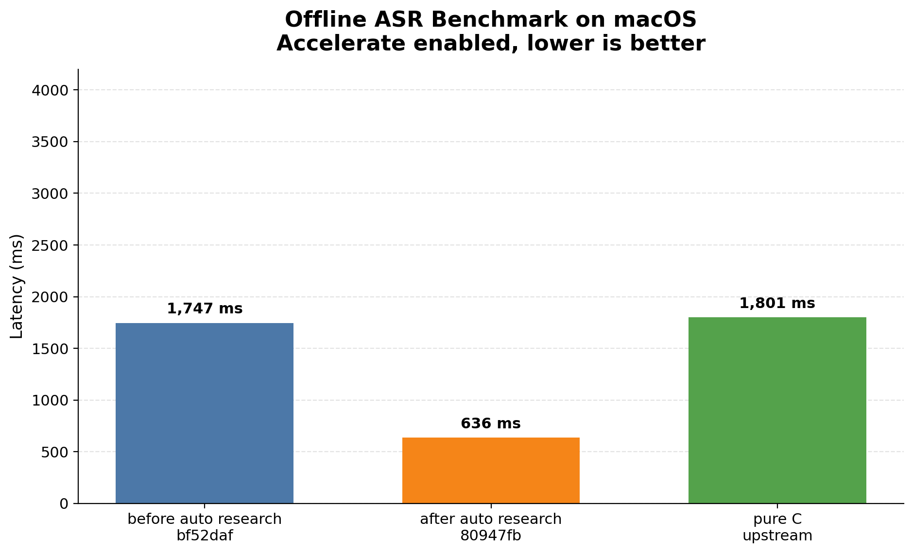
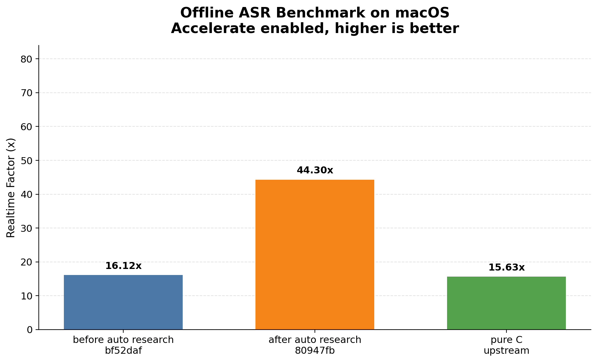

# Benchmark Report

## Methodology

- Offline benchmark on the same input WAV and model across three implementations.
- Rust baseline: `before auto research bf52daf`.
- Rust optimized: `after auto research 80947fb`.
- Upstream baseline: `antirez/qwen-asr` pure C implementation.
- macOS Accelerate enabled.
- Runs per target: `3`.
- Modes requested: `offline`.

## Environment

- CPU: `Apple M5`
- Cores: `10 physical / 10 logical`
- Memory: `32.0 GB`
- Machine arch: `arm64`
- macOS: `26.4.1`
- Rustc: `rustc 1.90.0 (1159e78c4 2025-09-14)`
- Model dir: `/Users/lizhuo/owork/q-asr/qwen3-asr-0.6b`
- Input file: `/Users/lizhuo/owork/q-asr/bench/samples/audio.wav`

## Results

| Implementation | Commit | Total ms | RTF |
|---|---:|---:|---:|
| before auto research | `bf52daf` | `1,747` | `16.12x` |
| after auto research | `80947fb` | `636` | `44.30x` |
| pure C upstream | - | `1,801` | `15.63x` |

## Findings

- With Accelerate enabled, `after auto research 80947fb` is `2.75x` faster than `before auto research bf52daf`.
- With Accelerate enabled, `after auto research 80947fb` is `2.83x` faster than the upstream pure C implementation.

